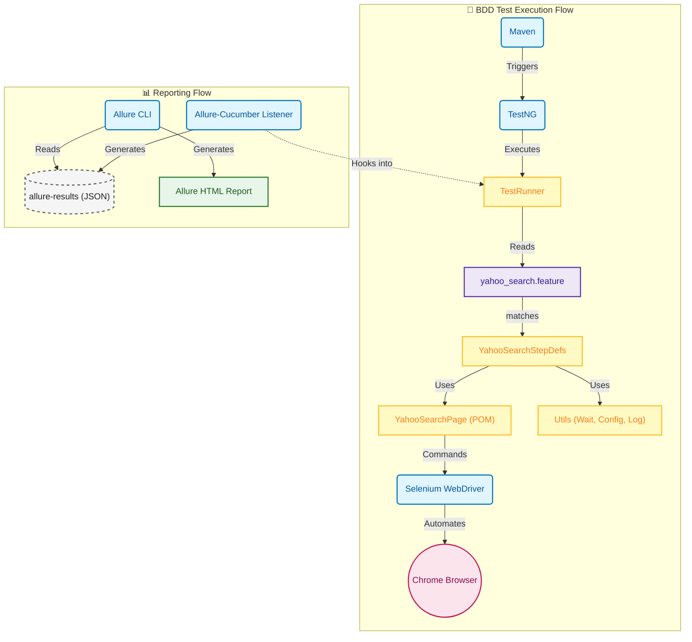
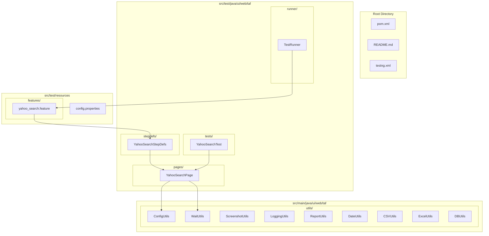

# 🚀 Comprehensive Test Automation Framework (CTAF)

<div align="center">

[](https://www.oracle.com/java/)
[](https://maven.apache.org/)
[](https://www.selenium.dev/)
[](https://cucumber.io/)
[](https://testng.org/)
[](https://qameta.io/allure-report/)

</div>

## 📋 Overview

This project is a **comprehensive, enterprise-grade test automation framework** designed for testing web applications with maximum efficiency and maintainability. It leverages industry-leading tools to provide a robust testing solution:

- **🌐 Selenium WebDriver** for powerful browser automation
- **🥒 Cucumber** for Behavior-Driven Development (BDD) 
- **🧪 TestNG** for advanced test execution control
- **📊 Allure** for stunning, interactive HTML reports
- **🔧 Extensive Utility Library** for common automation tasks

## ✨ Key Features

### 🎯 Core Testing Capabilities
- **🥒 BDD with Cucumber**: Write test scenarios in plain English (Gherkin) to bridge the gap between technical and non-technical stakeholders
- **📄 Page Object Model (POM)**: Promotes code reusability and maintainability by separating test logic from page interaction logic
- **⏱️ Robust Wait Strategies**: Centralized `WaitUtils` class supporting Implicit, Explicit, and Fluent waits for handling dynamic web elements

### 📊 Reporting & Debugging
- **📈 Comprehensive Reporting**: Integrated Allure reporting provides rich, interactive HTML reports with step-by-step logs and screenshots
- **📸 Visual Debugging**: Automatically captures screenshots of specific elements during interactions and full-page screenshots upon assertion or failure
- **🔍 Detailed Logging**: Standardized logging across the framework for better traceability

### 🛠️ Advanced Features
- **🌍 Environment Management**: Easily switch between environments (QA, Stage, Prod) using configuration files and system properties
- **📚 Extensive Utility Library**: Suite of helper classes for common automation tasks:
  - 📊 Data handling (CSV, Excel, XML)
  - 🗄️ Database connectivity
  - 📧 Email operations
  - 📄 PDF processing
  - 🔐 SSH operations
  - 🎭 Test data generation

## 🏗️ Test Architecture Diagram



## 📁 Project Structure

The **Comprehensive Test Automation Framework (CTAF)** follows a standard Maven project structure, organized to separate test logic, page objects, utilities, and resources for maximum maintainability.

### 📂 Directory Layout

#### 🏠 Root Directory
- **📄 `pom.xml`**: Maven configuration file managing project dependencies, plugins, and build settings
- **📖 `README.md`**: Project documentation including setup, execution, and architecture details  
- **⚙️ `testng.xml`**: TestNG suite configuration file for defining test execution order and parameters
- **🚫 `.gitignore`**: Specifies intentionally untracked files to ignore

#### 💻 Source Code (`src/main/java`)
Located at `src/main/java/ui/web/taf/`, this directory contains the core framework components and reusable utilities.

- **🔧 `utils/`**: Contains utility classes for common operations
  - **⚙️ `ConfigUtils.java`**: Loads configuration properties (e.g., browser type, URL) from files
  - **⏱️ `WaitUtils.java`**: Provides centralized methods for implicit, explicit, and fluent waits
  - **📸 `ScreenshotUtils.java`**: Handles capturing screenshots on failure or demand
  - **📝 `LoggingUtils.java`**: Standardizes logging across the framework
  - **📊 `ReportUtils.java`**: Helper methods for Allure reporting integration
  - **📅 `DateUtils.java`**: Utilities for date and time manipulation
  - **📈 `CSVUtils.java`**: Helper for reading and writing CSV files
  - **📊 `ExcelUtils.java`**: Helper for reading and writing Excel files
  - **🗄️ `DBUtils.java`**: Utilities for database connections and queries

#### 🧪 Test Code (`src/test/java`)
Located at `src/test/java/ui/web/taf/`, this directory contains the actual test scripts, step definitions, and runners.

- **📄 `pages/`**: Implements the Page Object Model (POM). Each class represents a web page and contains methods to interact with its elements
  - **🔍 `YahooSearchPage.java`**: Example page object for Yahoo Search
- **🥒 `stepdefs/`**: Contains Cucumber Step Definitions that map Gherkin steps to Java code
  - **📝 `YahooSearchStepDefs.java`**: Step definitions for the Yahoo Search feature
- **🏃 `runner/`**: Contains the test runner classes
  - **🚀 `TestRunner.java`**: The entry point for running Cucumber tests with TestNG
- **🧪 `tests/`**: Contains traditional TestNG tests (non-BDD) if needed
  - **🔬 `YahooSearchTest.java`**: Example TestNG test class

#### 📦 Test Resources (`src/test/resources`)
Contains non-Java files required for testing.

- **📋 `features/`**: Contains Cucumber `.feature` files written in Gherkin syntax
  - **📝 `yahoo_search.feature`**: Feature file describing Yahoo Search scenarios
- **⚙️ `config.properties`**: Default configuration file for the test environment

### 📊 Project Structure Diagram



## 🚀 Prerequisites

Ensure you have the following tools installed before setting up the framework:

### ⚙️ Required Software
1. **☕ Java JDK**: JDK 17 or higher is recommended
   - [Download Oracle JDK](https://www.oracle.com/java/technologies/downloads/)
   - Or use [OpenJDK](https://openjdk.org/)

2. **🔨 Maven**: Ensure Maven is installed and added to your system PATH
   - [Download Maven](https://maven.apache.org/download.cgi)
   - Verify installation: `mvn --version`

3. **🌐 Google Chrome**: The tests are configured to run on Chrome
   - [Download Chrome](https://www.google.com/chrome/)

4. **📊 Allure Commandline**: Required to view the generated reports locally
   - [Download Allure](https://qameta.io/allure-report/#_download)
   - Or install via package manager: `brew install allure` (macOS) or `choco install allure` (Windows)

## ⚙️ Configuration

The framework uses `src/test/resources/config.properties` for default settings. You can create environment-specific configuration files by following the pattern `config-{env}.properties`.

### 📄 Default Configuration (`config.properties`)

```properties
# Browser Configuration
browser=chrome
url=https://www.yahoo.com

# Wait Strategies (in seconds)
implicit.wait=10
explicit.wait=10

# Execution Mode
headless=false

# Reporting
screenshot.on.failure=true
```

### 🌍 Environment-Specific Configuration

To run against a different environment (e.g., QA), create a `config-qa.properties` file and run with `-Denv=qa`:

```bash
mvn clean test -Denv=qa
```

### 🔧 Supported Configuration Parameters

| Parameter | Description | Default Value |
|-----------|-------------|---------------|
| `browser` | Browser type (chrome, firefox, edge) | `chrome` |
| `url` | Application base URL | `https://www.yahoo.com` |
| `implicit.wait` | Implicit wait time in seconds | `10` |
| `explicit.wait` | Explicit wait time in seconds | `10` |
| `headless` | Run browser in headless mode | `false` |
| `screenshot.on.failure` | Capture screenshot on test failure | `true` |

## 🏃 How to Execute Tests

### 🖥️ Option 1: Using Maven Command Line

#### 🚀 Run all tests:
```bash
mvn clean test
```

#### 🌍 Run with a specific environment config:
```bash
mvn clean test -Denv=qa
```

#### 🏷️ Run specific TestNG groups:
```bash
mvn clean test -Dgroups=smoke
mvn clean test -Dgroups=regression
```

#### 🧪 Run specific test classes:
```bash
mvn clean test -Dtest=YahooSearchTest
```

### 💻 Option 2: Using IDE (IntelliJ / Eclipse)

#### 🎯 Run Cucumber Tests:
1. Navigate to `src/test/java/ui/web/taf/runner/TestRunner.java`
2. Right-click on the `TestRunner` class
3. Select **Run 'TestRunner'**

#### 🔬 Run TestNG Tests:
1. Navigate to any test class (e.g., `YahooSearchTest.java`)
2. Right-click on the class or specific test method
3. Select **Run** option

### ⚡ Option 3: Using TestNG XML

Run tests using the `testng.xml` configuration:
```bash
mvn clean test -DsuiteXmlFile=testng.xml
```

## 📊 Generating and Viewing Reports

After test execution, Allure results are generated in `target/allure-results`.

### 🎯 View Interactive Report

To view the comprehensive Allure report, run:
```bash
allure serve target/allure-results
```
This command will start a local web server and automatically open the interactive report in your default browser.

### 📈 Generate Static Report

To generate a static HTML report:
```bash
allure generate target/allure-results -o target/allure-report
```

### 📸 Report Features

The Allure report includes:
- **📊 Test Execution Summary**: Pass/fail statistics and execution time
- **📝 Step-by-Step Logs**: Detailed test execution steps
- **🖼️ Screenshots**: Automatic screenshots on failures
- **📋 Test Categories**: Grouped by smoke, regression, etc.
- **📊 Timeline**: Visual timeline of test execution
- **🔍 Attachments**: Logs, screenshots, and other artifacts

## 🛠️ Advanced Usage

### 📝 Writing New Tests

#### 🥒 BDD Tests (Cucumber)
1. Create a `.feature` file in `src/test/resources/features/`
2. Implement step definitions in `src/test/java/ui/web/taf/stepdefs/`
3. Create page objects in `src/test/java/ui/web/taf/pages/`

#### 🧪 TestNG Tests
1. Create test classes in `src/test/java/ui/web/taf/tests/`
2. Use TestNG annotations (`@Test`, `@BeforeMethod`, etc.)
3. Leverage existing utility classes

### 🔧 Custom Utilities

Extend the framework by adding new utilities:
- **📊 Data Utils**: For handling different data formats
- **🌐 API Utils**: For REST API testing
- **📧 Email Utils**: For email validation
- **🗄️ Database Utils**: For database operations

## 🔍 Troubleshooting

### 🚨 Common Issues

#### 🌐 Browser Driver Issues
- **Problem**: Browser driver compatibility issues
- **Solution**: Selenium 4.6+ uses Selenium Manager to automatically handle drivers. If you face issues, ensure your browser is up-to-date.

#### 🔌 Plugin Errors
- **Problem**: `Could not load plugin class` error
- **Solution**: Ensure your `TestRunner` references `io.qameta.allure.cucumber7jvm.AllureCucumber7Jvm`

#### ⏱️ Timeout Issues
- **Problem**: Tests failing due to element not found
- **Solution**: Adjust wait times in `config.properties` or use explicit waits in your tests

#### 📊 Report Generation Issues
- **Problem**: Allure report not generating
- **Solution**: Ensure AspectJ weaver is properly configured in Maven Surefire plugin

### 🐛 Debug Mode

Enable debug logging by adding this to your Maven command:
```bash
mvn clean test -Dmaven.test.failure.ignore=true -Dallure.results.directory=target/allure-results
```

## 🤝 Contributing

We welcome contributions to enhance the Comprehensive Test Automation Framework! Please follow these guidelines:

### 📝 Contribution Guidelines
1. **🌿 Fork** the repository
2. **🌿 Create** a feature branch (`git checkout -b feature/amazing-feature`)
3. **💾 Commit** your changes (`git commit -m 'Add amazing feature'`)
4. **🌿 Push** to the branch (`git push origin feature/amazing-feature`)
5. **🔄 Open** a Pull Request

### 🎯 Contribution Areas
- **🐛 Bug Fixes**: Help us squash bugs and improve stability
- **✨ New Features**: Add new utilities, integrations, or capabilities
- **📚 Documentation**: Improve README, add tutorials, or API docs
- **🧪 Test Cases**: Add more comprehensive test scenarios

## 📄 License

This project is licensed under the MIT License - see the [LICENSE.md](LICENSE.md) file for details.

## 🙏 Acknowledgments

- **🥒 Cucumber Team** for the amazing BDD framework
- **🌐 Selenium Team** for powerful browser automation
- **🧪 TestNG Team** for robust testing framework
- **📊 Allure Team** for beautiful reporting
- **☕ Apache Maven Team** for build management

## 📞 Support & Contact

- **🐛 Issues**: Report bugs via [GitHub Issues](https://github.com/your-username/ComprehensiveTestAutomationFramework/issues)
- **💬 Discussions**: Join our [GitHub Discussions](https://github.com/your-username/ComprehensiveTestAutomationFramework/discussions)
- **📧 Email**: Contact at support@example.com

---

<div align="center">

**⭐ If this framework helps you, please give it a star! ⭐**

Made with ❤️ by the Test Automation Community

</div>
